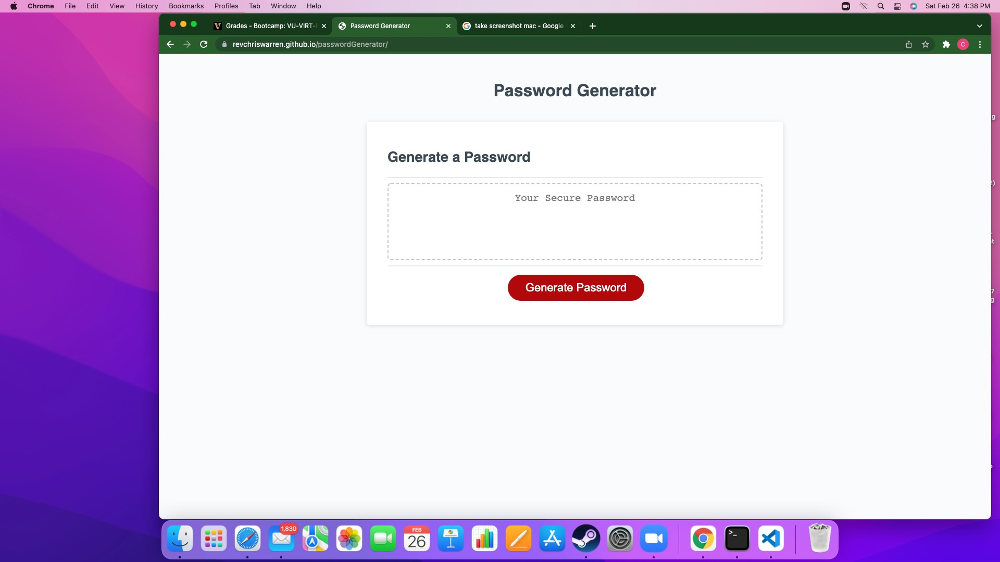

# passwordGenerator
## Password Generator able to create password between 8 and 128 characters.
## Password criteria is slected via window.confirm. Possible characters are Upper Case letters, lower case letters, numbers, and special characters.
### If no characters are selected, user receives window alert to try again.
### when charaters are selected, a confirmation alert states that a certain type of character has been selected.
### If number of charaters selected is outside paraneters, user receives an erro message to try again.

## Created using JavaScript if/else statements, loops, Math.random, converting numbers to characters in a string.

